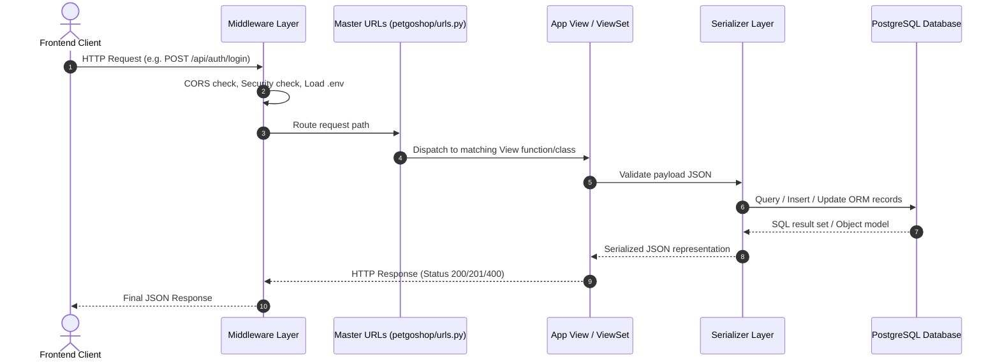
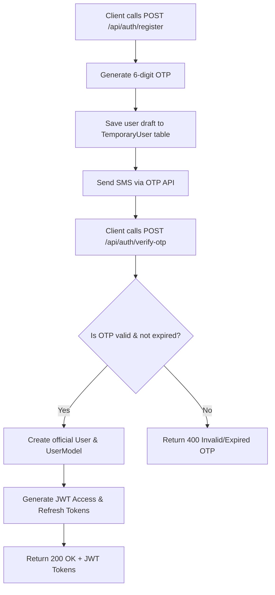
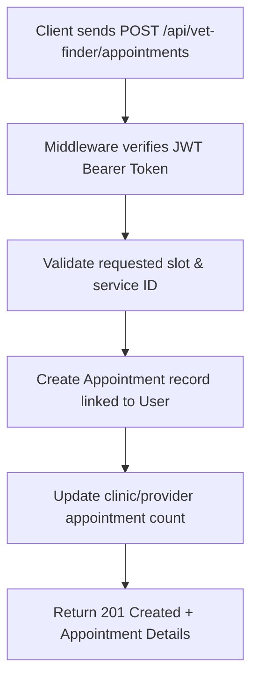
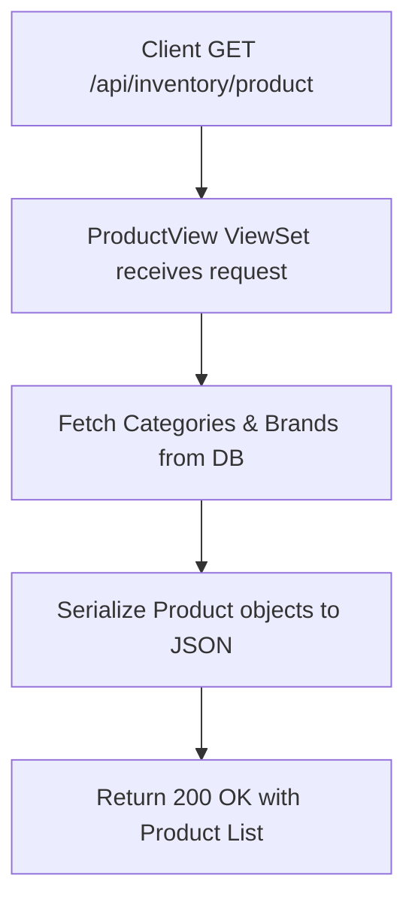

# 🏗️ PetGo Backend Architecture & API Flow Manual

This document provides a comprehensive, ground-up explanation of the **PetGo Django Backend**, including the directory structure, file responsibilities, data flow, and complete API execution lifecycles.

---

## 📁 1. Project Directory & File Structure (From Scratch)

```text
PetGo-Backend/
│
├── ⚙️ Root Configuration Files
│   ├── manage.py                # Django CLI management script
│   ├── .env                     # Secrets & environment configuration
│   ├── requirements.txt         # Python package dependencies
│   ├── db.sqlite3               # Local SQLite database (fallback)
│   ├── .gitignore               # Files excluded from git
│   └── .vercelignore            # Files excluded from deployment
│
├── 🧠 Core Django Project Config (petgoshop/)
│   ├── __init__.py              # Python package identifier
│   ├── settings.py              # Global settings (DB, Middleware, Apps, JWT, Env)
│   ├── urls.py                  # Master routing configuration (Root URLconf)
│   ├── wsgi.py                  # WSGI entry point for synchronous deployment
│   └── asgi.py                  # ASGI entry point for asynchronous features
│
├── 🔐 User & Authentication Module (user/)
│   ├── models.py                # User, TemporaryUser (OTP), UserAddress schemas
│   ├── views.py                 # Registration, OTP verification, JWT login logic
│   ├── serializers.py           # JSON validation & object transformation
│   └── urls.py                  # Auth endpoints (/api/auth/*)
│
├── 🏥 Veterinary Finder Module (vet_finder/)
│   ├── models.py                # Hospital, Tag, Appointment, Review schemas
│   ├── views.py                 # Hospital search, booking, rating views
│   └── urls.py                  # Vet API routes (/api/vet-finder/*)
│
├── 🏡 Foster House Finder Module (foster_house_finder/)
│   ├── models.py                # Foster House, Booking, Review schemas
│   ├── views.py                 # Boarding house discovery & booking views
│   └── urls.py                  # Foster API routes (/api/foster-house-finder/*)
│
├── ✂️ Training & Grooming Module (training_grooming/)
│   ├── models.py                # Service Center, Booking, Review schemas
│   ├── views.py                 # Spa, grooming & behavior training views
│   └── urls.py                  # Training API routes (/api/training-grooming/*)
│
├── 🐾 Pet Adoption Module (pet_adoption/)
│   ├── models.py                # PetAdoption (Pet info, approval status, adopter)
│   ├── views.py                 # Pet adoption listing & request management
│   └── urls.py                  # Adoption API routes (/api/pet-adoption/*)
│
└── 📦 Product Inventory Module (inventory/)
    ├── models.py                # Category, Brand, Product schemas
    ├── views.py                 # Product catalog ViewSets
    └── urls.py                  # Inventory API routes (/api/inventory/*)
```

---

## 🔄 2. How Django Request-Response Flow Works

Every HTTP request sent by a frontend app (React, Next.js, Mobile) follows this exact execution pipeline:



---

## 🌊 3. End-to-End API Workflows

### Flow A: User Registration via Phone & OTP Verification



---

### Flow B: Service Booking (Vet Clinic / Foster House / Grooming)



---

### Flow C: Product Catalog & Inventory Access



---

## 🔑 Summary of Responsibilities

1. **`settings.py`**: Reads `.env` for secrets, sets up PostgreSQL DB, initializes Django REST Framework, SimpleJWT, and CORS headers.
2. **`serializers.py`**: Converts complex Django ORM objects to Python dicts (JSON) and validates incoming payload formats.
3. **`views.py`**: Contains business logic, permissions, DB queries, and response generation.
4. **`models.py`**: Defines database tables, relationships (Foreign Keys, OneToOne), and schema constraints.
